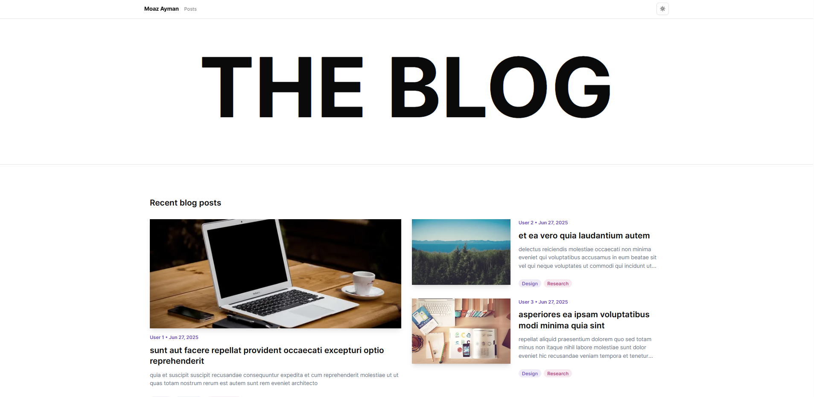
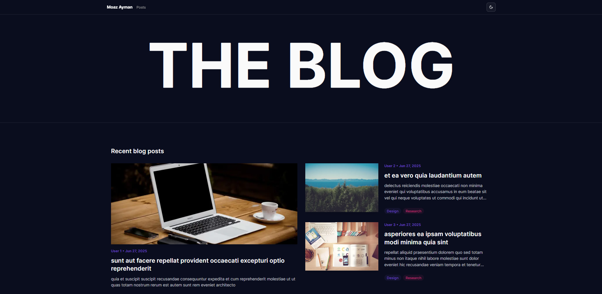
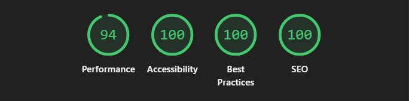
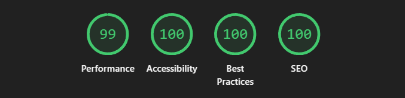
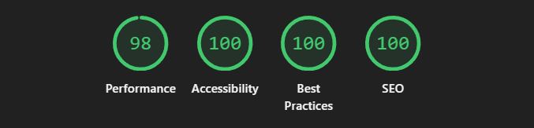

# 📝 The Blog - Modern TypeScript Blog

A beautiful, responsive blog application built with **Next.js 14**, **TypeScript**, and **Tailwind CSS**. Features smooth animations, dark/light theme support, and a clean modern design.




## ✨ Features

### 🎨 **Modern Design**

- Clean, minimalist UI with smooth animations powered by GSAP
- Responsive design that works beautifully on all devices
- Dark/Light theme support with system preference detection
- Custom color scheme with carefully chosen typography

### 📱 **Responsive Layout**

- Mobile-first responsive design
- Optimized for desktop, tablet, and mobile viewing
- Smooth hover effects and transitions

### 🚀 **Performance Optimized**

- Built with Next.js 14 App Router for optimal performance
- Image optimization with Next.js Image component
- Lazy loading and progressive enhancement
- SEO-optimized with proper meta tags

### 🎯 **User Experience**

- Smooth page transitions and loading states
- Pagination for blog posts
- Search-friendly URLs (`/posts/[id]`)
- Error handling with user-friendly messages

## 🛠️ Tech Stack

| Technology       | Purpose                         |
| ---------------- | ------------------------------- |
| **Next.js 14**   | React framework with App Router |
| **TypeScript**   | Type-safe development           |
| **Tailwind CSS** | Utility-first CSS framework     |
| **GSAP**         | High-performance animations     |
| **Lucide React** | Beautiful icons                 |

## 🚀 Performance Metrics

### Home Page



### Blogs Page



### Blog Detail Page



## 🎯 Project Structure

```
src/
├── app/                  # Next.js App Router pages
│   ├── posts/            # Blog posts routes
│   │   ├── [id]/         # Dynamic blog post pages
│   │   └── page.tsx      # Posts listing page
│   └── page.tsx          # Home page
├── components/
│   ├── home/             # Homepage components
│   ├── post/             # Blog post components
│   ├── posts/            # Posts listing components
│   ├── ui/               # Reusable UI components
│   └── layouts/          # Layout components
├── hooks/                # Custom React hooks
├── interfaces/           # TypeScript interfaces
└── lib/                  # Utility functions
```

## 🎨 Key Components

### 🎭 **Animated Components**

- **AnimatedItem**: GSAP-powered animations with intersection observer
- **Smooth Transitions**: fadeIn, slideInLeft, slideInRight, slideInUp, scaleIn
- **Stagger Animations**: Sequential element animations

### 🎯 **Blog Features**

- **Dynamic Routing**: `/posts/[id]` for individual blog posts
- **Pagination**: Navigate through posts with elegant pagination
- **Image Optimization**: Automatic image loading with fallbacks
- **Loading States**: Skeleton loaders for better UX

### 🎨 **UI Components**

- **Theme Toggle**: Dark/Light mode switcher
- **Responsive Navigation**: Mobile-friendly navigation
- **Error Boundaries**: Graceful error handling
- **Loading Skeletons**: Beautiful loading states

## 🚀 Getting Started

### Prerequisites

- Node.js 18+
- npm, yarn, or pnpm

### Installation

1. **Clone the repository**

   ```bash
   git clone git@github.com:GoatMoaz/The-Blog.git
   cd the-blog
   ```

2. **Install dependencies**

   ```bash
   npm install
   # or
   yarn install
   # or
   pnpm install
   ```

3. **Run the development server**

   ```bash
   npm run dev
   # or
   yarn dev
   # or
   pnpm dev
   ```

4. **Open your browser**
   Navigate to [http://localhost:3000](http://localhost:3000)

## 🎨 Customization

### 🎯 **Themes**

The project uses CSS custom properties for theming. You can customize colors in `src/app/globals.css`:

```css
:root {
  --primary: oklch(0.205 0 0);
  --secondary: oklch(0.97 0 0);
  --badge-primary: oklch(0.498 0.1953 291.5);
  /* Add your custom colors */
}
```

### 🎭 **Animations**

Customize animations in `src/hooks/useGSAP.ts`:

```typescript
// Add custom animation functions
const customAnimation = (element: Element) => {
  gsap.fromTo(
    element,
    {
      /* initial state */
    },
    {
      /* final state */
    }
  );
};
```

## 🔧 API Integration

The blog fetches data from:

- **Posts**: `https://jsonplaceholder.typicode.com/posts`
- **Images**: `https://picsum.photos/v2/list`

### Custom API

To use your own API, update the fetch URLs in:

- `src/hooks/useFetchPosts.ts`
- `src/hooks/useFetchPost.ts`

## 📱 Responsive Breakpoints

| Device  | Breakpoint       | Description          |
| ------- | ---------------- | -------------------- |
| Mobile  | `< 768px`        | Single column layout |
| Tablet  | `768px - 1024px` | Two column grid      |
| Desktop | `> 1024px`       | Three column grid    |
| Large   | `> 1280px`       | Optimized spacing    |

## 🚀 Deployment

### Vercel (Recommended)

1. Push your code to GitHub
2. Connect your repository to Vercel
3. Deploy with zero configuration

### Other Platforms

```bash
# Build for production
npm run build

# Start production server
npm start
```

## 🤝 Contributing

1. Fork the repository
2. Create a feature branch (`git checkout -b feature/amazing-feature`)
3. Commit your changes (`git commit -m 'Add amazing feature'`)
4. Push to the branch (`git push origin feature/amazing-feature`)
5. Open a Pull Request

## 🙏 Acknowledgments

Thanks to [Buguard](https://buguard.io/) for the opportunity to work on this project. Their support and resources made this possible.

---

<div align="center">
  <p>Made with ❤️ using Next.js and TypeScript</p>
  <p>⭐ Star this repo if you found it helpful!</p>
</div>
